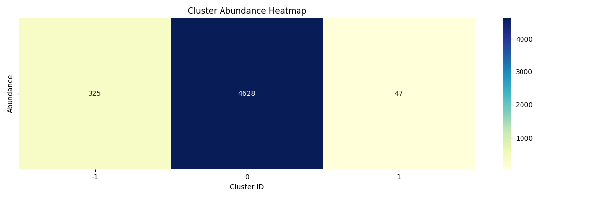

# 🧬 De Novo Biodiversity Discovery from Deep-Sea eDNA using AI

A prototype AI pipeline for discovering potential novel organisms from environmental DNA (eDNA) sequences using transformer-based embeddings and unsupervised learning.

---

## 🚀 Overview

This project focuses on analyzing genomic sequences from deep-sea environments to identify biodiversity patterns and detect potentially novel taxa.

The pipeline leverages:
- **DNABERT (Transformer model)** for genomic embeddings  
- **HDBSCAN** for clustering  
- **UMAP** for dimensionality reduction  
- **Plotly & Matplotlib** for visualization  

---

## 🧠 Key Features

- 🔬 Processes raw **FASTA genomic data** (16S rRNA & eukaryotic sequences)  
- 🧬 Generates **DNA embeddings using DNABERT**  
- 📊 Applies **HDBSCAN clustering** to group sequences  
- 🚨 Detects **potential novel sequences** based on similarity thresholds  
- 📈 Provides **2D & 3D visualizations** of biodiversity patterns  

---

## ⚙️ Tech Stack

- Python  
- PyTorch  
- Transformers (DNABERT)  
- Scikit-learn  
- UMAP  
- HDBSCAN  
- Biopython  
- Plotly, Matplotlib, Seaborn  

---

## 📂 Project Structure

```
de-novo-biodiversity-discovery/

ribosome_RNA/
  ├── data/
  ├── outputs/
  ├── embeddings.py
  ├── newCHECKfasta.py
  ├── newCLUSTER.py
  ├── UMAP3d.py
  └── (other experimental scripts)

eukaryote/
  ├── data/
  ├── output/
  ├── embeddings.py
  ├── cluster.py
  ├── checkFASTA.py
  └── (other experimental scripts)

README.md
requirements.txt
```

---

## ▶️ How to Run

### 1. Clone the repository
```bash
git clone https://github.com/AdwitiyaRana/de-novo-biodiversity-discovery.git
cd de-novo-biodiversity-discovery
```

### 2. Create virtual environment
```bash
python3 -m venv venv
source venv/bin/activate
```

### 3. Install dependencies
```bash
pip install -r requirements.txt
```

---

## 🧪 Running the Pipeline

### 🔹 For 16S Ribosomal RNA
```bash
python ribosome_RNA/newCHECKfasta.py
```

### 🔹 For Eukaryotic Sequences
```bash
python eukaryote/checkFASTA.py
```

### 🔹 Visualization
```bash
python ribosome_RNA/UMAP3d.py
```

---

## 📊 Screenshots

### 🔹 Cluster Visualization


---

## ⚠️ Note

- This is a **prototype implementation** developed as part of the **Smart India Hackathon (SIH)**  
- Currently supports:
  - 16S ribosomal RNA data  
  - Eukaryotic sequences  
- Designed to be extended for large-scale biodiversity discovery  

---

## 🚀 Future Improvements

- Multi-species genomic integration  
- Improved novelty detection  
- Scalable pipeline for large datasets  
- Web-based interface for researchers  

---

## 👨‍💻 Author

**Adwitiya Rana**  
- GitHub:   https://github.com/AdwitiyaRana  
- LinkedIn: www.linkedin.com/in/adwitiya-rana-161161286
---

## ⭐ If you found this useful, consider starring the repository!